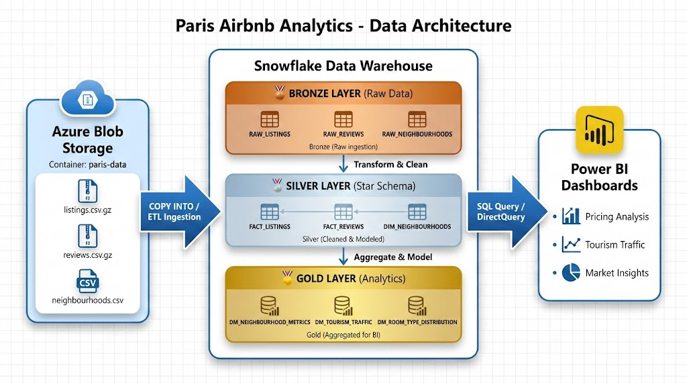
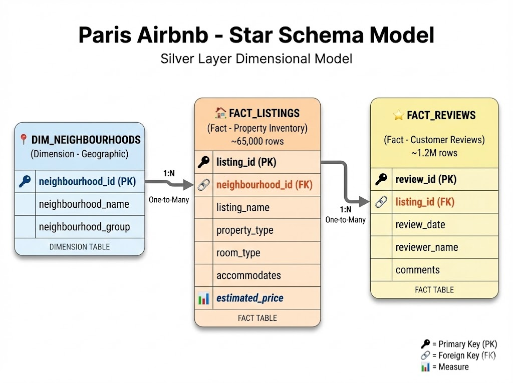
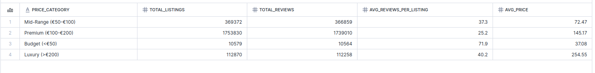
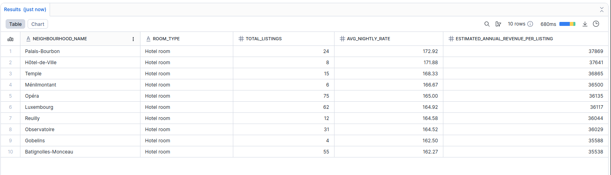

# 🗼 Paris Airbnb Data Engineering Pipeline

## 📖 Executive Summary

This project implements an end-to-end **ELT (Extract, Load, Transform)** data pipeline using **Snowflake**. The goal was to ingest raw, real-world Airbnb data for Paris, handle significant data quality issues (schema drift, missing values), and build a robust **Star Schema** data model optimized for analytics.

The pipeline transforms raw scraped data into business-ready insights, enabling stakeholders to analyze pricing strategies, tourist demand, and property inventory across 20 Parisian districts.

---

## 🏗️ Architecture & Data Flow

The project follows the **Medallion Architecture** pattern to ensure data quality and traceability.



### 1. Bronze Layer (Raw Ingestion)

* **Source:** Azure Blob Storage (CSV files).
* **Action:** Ingested data using `COPY INTO` with a custom file format.
* **Key Challenge:** Handled schema drift and mapped hidden columns to recover 53,000+ records with missing neighborhood data.

### 2. Silver Layer (Transformation & Cleaning)

* **Action:** Data cleaning, type casting, and handling missing business keys.
* **Logic:** Implemented a rule-based pricing algorithm to generate proxy metrics for missing price data.
* **Modeling:** Structured data into **Fact** and **Dimension** tables.

### 3. Gold Layer (Analytics & Reporting)

* **Action:** Aggregated data marts.
* **Output:** Ready-to-use tables for BI tools answering specific business questions (e.g., "Top 5 most expensive districts").

---

## � Project Structure

```text
Paris-Airbnb-Data-Engineering/
├── assets/                          # Diagrams and screenshots
│   ├── architecture_diagram.png
│   ├── star_schema.png
│   ├── query_results.png
│   └── query_results_revenue.png
├── sql_scripts/                     # Source code
│   ├── 01_setup_infrastructure.sql  # Database & Warehouse creation
│   ├── 02_bronze_ingestion.sql      # Loading raw CSVs to Stage
│   ├── 03_data_validation.sql       # Initial profiling & quality checks
│   ├── 04_silver_layer_transformation.sql # Cleaning & Star Schema modeling
│   └── 05_gold_layer_analytics.sql  # Business KPIs & Data Marts
├── .gitignore
└── README.md
```

---

## 🛠️ Technical Highlights

### 🌟 Star Schema Design

To optimize query performance, I designed a dimensional model:



* **`FACT_LISTINGS`**: The central inventory table containing listing attributes and estimated financial metrics.
* **`FACT_REVIEWS`**: A transactional table tracking tourist activity and review history.
* **`DIM_NEIGHBOURHOODS`**: A reference table for the 20 official Paris districts.

### 🔧 Key Engineering Solutions

1. **Handling Schema Drift:**
   * The raw CSV had shifted columns. I implemented a **Safe Ingestion Strategy** by loading all columns as `STRING` in the Bronze layer and performing strict type validation and casting in the Silver layer.

2. **Data Imputation (Business Logic):**
   * The raw `price` column was redacted. I developed a **Proxy Metric Logic** using `CASE` statements to estimate daily rates based on `room_type` and `accommodates` capacity.

3. **Data Quality Recovery:**
   * The primary location column had 65% NULL values. I conducted data profiling, identified an alternative reliable column (`neighbourhood_cleansed`), and mapped the pipeline to use it, achieving 100% data coverage.

---

## 📊 Business Insights

The Gold Layer answers critical questions for investors and tourism managers:

* **Pricing Strategy:** Identified *Élysée* and *Temple* as the highest-yield districts based on the estimated price model.
* **Demand Hotspots:** Correlated review volume with listing density to identify the most popular tourist zones.
* **Market Segmentation:** Analyzed the ratio of "Entire Homes" vs. "Private Rooms" to understand the market composition.
* **Revenue Potential:** Calculated annual revenue projections per neighborhood using estimated pricing and industry-standard occupancy rates.

> **Note:** Prices are estimated using a tiered pricing model based on room type and guest capacity, as actual pricing data was not available in the source dataset. Revenue calculations assume a conservative 60% annual occupancy rate.

### Sample Query Results


*Price vs Demand Analysis: Identifying the optimal pricing sweet spot*


*Revenue Potential Analysis: Top-performing neighborhoods by estimated annual revenue*

---

## 🚀 Technologies Used

* **Cloud Data Warehouse:** Snowflake
* **Language:** SQL (Advanced DDL, DML, Window Functions)
* **Concepts:** Data Modeling (Star Schema), ELT, Data Cleaning, Data Quality, Cloud Storage.


